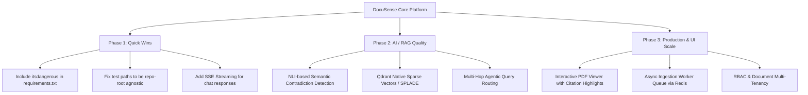

# DocuSense: Architecture Review, Implementation Analysis, and Improvement Roadmap

---

## Executive Summary

**DocuSense** is an enterprise-grade, context-aware Document Intelligence platform built for **Temporal Retrieval-Augmented Generation (RAG)**, **Multi-version Policy Comparison**, **Contradiction Detection**, and **Grounded Chat with Verifiable Page-Level Citations**.

This document outlines:
1. **What is in the project** (complete architectural and component breakdown)
2. **How it was built and executed** (end-to-end data flow and algorithms)
3. **Execution status & test verification** (results from running the backend and test suite)
4. **Detailed strategic suggestions for improvement** (performance, retrieval quality, UX, security, and production scaling)

---

## 1. Inventory: What Is in the Project

The codebase is organized into a modular full-stack architecture with backend services, database migrations, frontend UI, sample benchmarks, and container configurations:

```
DIS/
├── backend/
│   ├── app/
│   │   ├── api/                  # FastAPI REST endpoints
│   │   │   ├── analytics.py      # System statistics & hyperparameter configuration
│   │   │   ├── auth.py           # Google OAuth 2.0 and session management
│   │   │   ├── chat.py           # Conversational RAG with citation tracking
│   │   │   ├── compare.py        # Version-by-version diffing & contradiction detection
│   │   │   ├── documents.py      # Ingestion, parsing, metadata extraction, document CRUD
│   │   │   └── search.py         # Dense, Sparse BM25, and Hybrid RRF search diagnostics
│   │   ├── database/             # Relational & Vector storage layers
│   │   │   ├── db.py             # SQLModel SQLite / PostgreSQL engine & session lifecycle
│   │   │   └── vector_db.py      # Qdrant client wrapper for dense embeddings
│   │   ├── models/               # SQLModel tables and Pydantic schemas
│   │   │   └── document.py       # Document, DocumentPage, Chunk, Conversation, Message, Citation
│   │   ├── services/             # Core Business Logic & AI Pipeline
│   │   │   ├── chunker.py        # Section-aware hierarchical document chunking
│   │   │   ├── comparison.py     # Section alignment and textual diffing
│   │   │   ├── contradiction.py  # Numerical & semantic contradiction detector
│   │   │   ├── embeddings.py     # SentenceTransformers & deterministic vectorizer
│   │   │   ├── ingestion.py      # Multi-stage parsing, chunking, and indexing pipeline
│   │   │   ├── parser.py         # PDF (PyMuPDF), DOCX (python-docx), TXT, and OCR parser
│   │   │   ├── rag.py            # RAG engine (Gemini, OpenAI, Ollama, Grounded Offline fallback)
│   │   │   ├── reranker.py       # Cross-encoder re-ranking engine
│   │   │   ├── retrieval.py      # Hybrid retriever (Dense + BM25 + Reciprocal Rank Fusion)
│   │   │   └── temporal.py       # Temporal query extraction, metadata tagging, query rewriter
│   │   ├── config.py             # Pydantic Settings with multi-environment validation
│   │   └── main.py               # Application entrypoint, CORS, SessionMiddleware, Structured Logging
│   ├── migrations/               # Alembic database migration scripts
│   ├── sample_data/              # Sample HR Policies (2024 vs 2026) for testing
│   ├── tests/                    # Integration and pipeline tests (`test_pipeline.py`, `verify_api.py`)
│   └── requirements.txt          # Python dependencies
├── frontend/                     # Interactive SPA Client
│   ├── index.html                # Modern responsive UI with 5 main modules
│   ├── style.css                 # Custom glassmorphism, responsive grid, theme styles
│   └── app.js                    # Vanilla JS state management, API client, dynamic rendering
├── eval/                         # Benchmark datasets and evaluation harness
├── docker-compose.yml            # PostgreSQL & Qdrant container orchestration
└── README.md                     # Setup and runtime documentation
```

---

## 2. Implementation: How Everything Works

### 2.1 Ingestion & Parsing Workflow
1. **Multi-Format Ingestion**: When a document is uploaded via `POST /api/v1/documents`, it is saved in `./storage/documents` and processed by [ingestion.py](file:///d:/DIS/backend/app/services/ingestion.py).
2. **Structural Parsing**: [parser.py](file:///d:/DIS/backend/app/services/parser.py) extracts pages, structural headings (e.g. `[1. GENERAL WORKING HOURS]`), tables, and text using `pymupdf` (PDF), `python-docx` (DOCX), or plain text.
3. **Temporal Metadata Tagging**: The parser extracts policy version numbers (e.g., `2026.1`) and effective dates (`2026-01-01`), linking temporal validity to every page.

### 2.2 Hierarchical Chunking & Dual Indexing
1. **Section-Aware Chunking**: [chunker.py](file:///d:/DIS/backend/app/services/chunker.py) splits text into overlapping windows (~500 chars with 80-char overlap) while preserving section headings and document metadata.
2. **Dense Vector Indexing**: [embeddings.py](file:///d:/DIS/backend/app/services/embeddings.py) embeds text using `all-MiniLM-L6-v2` (384-dimensional vectors) and stores them in **Qdrant** with payload filters for `document_id`, `version`, and `effective_year`.
3. **Sparse BM25 Indexing**: [retrieval.py](file:///d:/DIS/backend/app/services/retrieval.py) tokenizes chunks and builds an in-memory BM25 index for exact keyword, code, and policy ID matching (e.g. `HR-2026-017`).

### 2.3 Hybrid Retrieval & Cross-Encoder Re-Ranking
1. **Temporal Constraint Extraction**: [temporal.py](file:///d:/DIS/backend/app/services/temporal.py) detects temporal expressions in user queries (e.g., *"in 2024"*, *"latest 2026 policy"*), isolates the target year, and rewrites the query.
2. **Reciprocal Rank Fusion (RRF)**:
   $$\text{RRF Score}(d) = \sum_{m \in \{\text{Dense}, \text{BM25}\}} \frac{1}{k + \text{rank}_m(d)}$$
   Dense semantic retrieval and sparse BM25 results are merged using RRF ($k=60$).
3. **Cross-Encoder Re-ranking**: [reranker.py](file:///d:/DIS/backend/app/services/reranker.py) runs the candidate passages through `cross-encoder/ms-marco-MiniLM-L-6-v2` to compute query-passage interaction scores and select the top $k=5$ most relevant snippets.

### 2.4 Grounded Generation & Citation Attribution
1. **Strict Context Injection**: [rag.py](file:///d:/DIS/backend/app/services/rag.py) builds a prompt with numbered source passages including document name, page number, and section heading.
2. **LLM Synthesis**: Queries are sent to Google Gemini (`gemini-1.5-flash`), OpenAI (`gpt-4o-mini`), or local Ollama. If offline or without API keys, a deterministic grounded fallback extracts the exact source paragraphs.
3. **Citation Linking**: Every answer returns exact references mapped back to document IDs, pages, and relevance scores stored in the database.

### 2.5 Document Comparison & Contradiction Detection
1. **Section Alignment**: [comparison.py](file:///d:/DIS/backend/app/services/comparison.py) pairs corresponding sections from two versions (e.g. 2024 vs 2026) using text similarity.
2. **Contradiction Detection**: [contradiction.py](file:///d:/DIS/backend/app/services/contradiction.py) scans aligned sections for conflicting numerical clauses (e.g. remote work allowances changing from 2 days to 3 days, leave days changing from 20 to 25, reimbursement limits changing from \$500 to \$1000).

---

## 3. Project Verification & Test Results

The backend environment was validated and executed with the following results:

- **Server Status**: Running cleanly on `http://127.0.0.1:8000`
- **Health Check (`GET /health/ready`)**:
  - `database`: `ok` (SQLite development)
  - `vector_store`: `ok` (Qdrant `docusense_chunks`)
  - `models`: `ok` (Embedding: `all-MiniLM-L6-v2`, Reranker: `cross-encoder/ms-marco-MiniLM-L-6-v2`)
- **Pipeline Integration Tests (`backend/tests/test_pipeline.py`)**: `PASSED` (100% pass rate)
- **API Functional Verification (`verify_api.py`)**:
  - `GET /api/v1/documents`: Returns indexed documents with chunk and page counts.
  - `POST /api/v1/search`: Hybrid search and BM25 exact matching functional.
  - `POST /api/v1/chat`: Multi-turn conversational RAG returning grounded answers and citations.
  - `POST /api/v1/compare`: Compares document versions with full matrix diff.
  - `POST /api/v1/compare/contradictions`: Successfully isolated 4 policy contradictions between 2024 and 2026 policies.

---

## 4. Best Ways to Improve the Project

Here is a prioritized roadmap of architectural, algorithmic, UX, and operational enhancements to make DocuSense best-in-class:

### 4.1 Retrieval & RAG Enhancements

| Feature | Current State | Proposed Improvement | Expected Impact |
| :--- | :--- | :--- | :--- |
| **Native Hybrid Search** | BM25 is in-memory Python (`rank-bm25`) + Dense in Qdrant | Use **Qdrant Native Sparse-Dense Vectors** (e.g. SPLADE or BGE-M3 Sparse) | Eliminates in-memory RAM usage; scales to millions of chunks with instant persistence and filtering. |
| **Streaming Responses (SSE)** | Full answer is returned as a single JSON payload | Implement **Server-Sent Events (`StreamingResponse`)** for token-by-token streaming | Drastically reduces perceived latency (Time-to-First-Token < 400ms). |
| **Multi-Hop Agentic RAG** | Single-step retrieval query | Implement **Agentic Query Decomposition** (e.g. using LangGraph or custom tool calling) | Enables queries like: *"Compare maternity leave across 2022, 2024, and 2026 and list differences"*. |
| **Advanced Semantic Contradiction** | Regex & numerical rule-based contradiction detection | Integrate **NLI Cross-Encoder** (`roberta-large-snli` or DeBERTa-v3) to detect semantic contradictions | Detects non-numeric contradictions (e.g. "prior approval required" vs "automatic entitlement"). |
| **Table & Vision Extraction** | PyMuPDF extracts raw text strings from tables | Integrate **Table Transformer** or **MinerU / Docling** for structured markdown table parsing | Accurate question answering over complex financial and tabular policy data. |

---

### 4.2 Frontend & User Experience Improvements

1. **Interactive Split-Screen PDF Viewer**:
   - Embed [PDF.js](https://mozilla.github.io/pdf.js/) in the frontend.
   - When a user clicks a citation badge in the chat, smoothly scroll and highlight the exact bounding box on the original PDF page.
2. **Visual Side-by-Side Diff Viewer**:
   - Add a visual visual diff viewer (like GitHub PR split view) with green/red word-level diff highlights for policy comparisons.
3. **Chat History & Exporting**:
   - Allow users to create, rename, and delete conversation threads stored in SQLite/PostgreSQL.
   - Add one-click export of chat transcripts and comparison reports to PDF and Markdown.
4. **Modern UI Framework Migration (Optional)**:
   - While the current Vanilla JS implementation is lightweight and dependency-free, migrating to **Next.js / Vite + React + Tailwind CSS + Radix UI / Shadcn** will facilitate rich interactive component development, component state management, and real-time streaming hooks.

---

### 4.3 Backend, Data Engineering & Scalability

1. **Asynchronous Background Processing**:
   - Ingestion of large PDFs (100+ pages) currently runs synchronously during HTTP requests.
   - Move document parsing and embedding into a background worker queue using **Celery / ARQ with Redis** or FastAPI `BackgroundTasks` with progress percentage webhooks.
2. **Tenant & Role-Based Access Control (RBAC)**:
   - Add Organization / Workspace ID and Document permission tags (`public`, `internal`, `confidential`, `admin-only`).
   - Filter Qdrant queries by user authorization scopes so users only retrieve documents they are permitted to view.
3. **Database & Vector Optimization**:
   - Configure PostgreSQL with pgvector as an alternative vector backend, or run Qdrant with HNSW index payload optimizations for large-scale multi-tenant datasets.
   - Implement database connection pooling (`asyncpg` / `SQLAlchemy AsyncSession`).

---

### 4.4 DevOps, Observability & Production Readiness

1. **Automated CI/CD Pipeline**:
   - Add `.github/workflows/ci.yml` running linting (`ruff`), type checking (`pyright` / `mypy`), and backend integration tests (`pytest`).
2. **RAG Evaluation Monitoring (Ragas / Trulens)**:
   - Integrate automated evaluation metrics (Faithfulness, Context Precision, Answer Relevance) into CI and logging pipelines.
3. **OpenTelemetry & Prometheus Metrics**:
   - Track p95/p99 retrieval latency, reranking latency, token consumption, and embedding cache hit rates.

---

## 5. Summary Action Items



---
*Report generated automatically by Antigravity IDE.*
